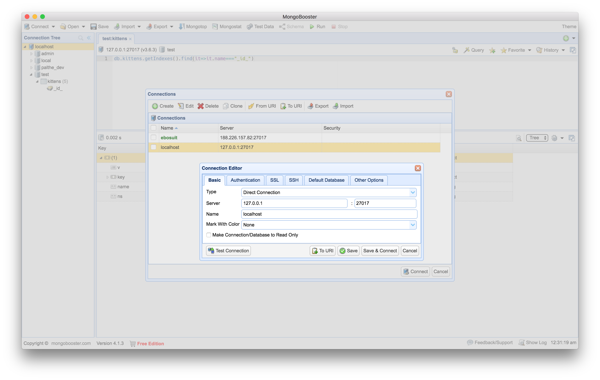
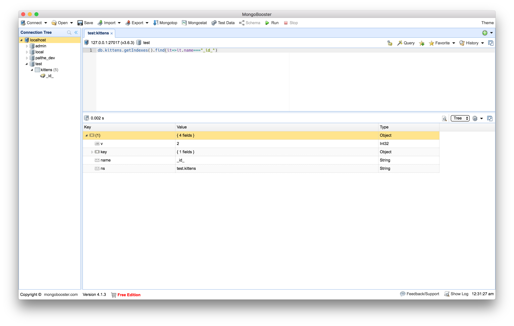

# mean-and-clean

This is a simple tutorial to get you started with the MEAN, MERN, MEVN or what ever stack you want to call it.

## MongoDB(M), Express(E), Angular(A)/React(R)/Vue(V), NodeJS(N).

This is the first step: start with Node.js, MongoDB and Mongoose.

I wanted to use as little a possible, but I just didn't want to write directly on MongoDB server.

My focus is on Osx but I am confinced it is also usuable for Windows or Linux. If not, create an issue of do a pull request.


# Libs

- fake info to populate a empty database quickly : <https://github.com/marak/Faker.js/>


# Install

The next steps are to install everything you need.
So we need node and we need mongDB

I assume we will use `brew` for this:

### Step 00:


```
# install node.js (and NPM)
brew install nodejs

# install mongoDB (read more on website)
brew install mongodb
sudo chown -R `id -un` /data/db
# Enter your password and your done after that
```

source:

- <https://docs.mongodb.com/manual/tutorial/install-mongodb-on-os-x/>
- <https://treehouse.github.io/installation-guides/mac/mongo-mac.html>
- <https://nodejs.org/>
- <https://www.mongodb.com/what-is-mongodb>
- <https://docs.mongodb.com/manual/tutorial/getting-started/>


### Step 01

Intialize a new project with npm package

```
npm init
# if you don't want to answer all the questions from a stranger (NPM) use:
npm init -y
```

And use NPM to install [Mongoose](http://mongoosejs.com/docs/index.html)

```
npm install mongoose
```

update `package.json` with (if you want..., you don't need it)

```
  "scripts": {
    "start": "npm run mongodb & npm run node",
    "mongodb": "mongod",
    "node": "node server",
    "test": "echo 'test!'"
  },
```

### step 02

now we need to start mongoDB via the terminal:

```
mongod
# open other terminal
mongo
# or
mongo --host 127.0.0.1:27017
```

### step 03

Create a file `server.js` in the root folder

start the [`server.js`](server.js) via Node.js, and add data to the database

I followed the [Getting Started](http://mongoosejs.com/docs/index.html) tutorial

```bash
node server
```

### step 04

I like to see what happens to the database, so I have a GUI install for mongoDB

In my case mongobooster or robo-3t

```
brew install homebrew/cask/mongobooster
brew install homebrew/cask/robo-3t
```




open mongobooster

and press "connect" > create > localhost (see picture)

press "run"




source:

- mongobooster (https://nosqlbooster.com/)
- Robomonger (https://robomongo.org/)


## Original project

the following is really well written, but has a very steap learning curve.

- http://mern.io
- http://mean.io


----


Pre-requisites
You need to have a basic understanding of all the four technologies that make up the MERN stack. You should also have npm (Node Package Manager) installed. This is NOT a tutorial on MongoDB, Express, React or NodeJS.

---


Make sure MongoDB service is running.


- axios will be used to send requests to server to fetch or insert data.
- body-parser parses the request bodies. We can get access to the information inside the request via req.body.
- babel-cli will be used to compile files from the command line.
- express is a web application framework for NodeJS.
- mongoose is an ODM framework for MongoDB.
- nodemon automatically restarts the server whenever the code changes.
- react-bootstrap lets us use bootstrap components with React.
- react-modal lets us create a modal dialog in React.
- react-router-dom lets us use React router.


